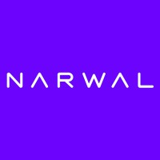

# 云鲸扫地机器人 — Home Assistant 集成 / Narwal CN Integration

<p align="center">
  
</p>

<p align="center">
  <a href="#中文">中文</a> · <a href="#english">English</a>
</p>

---

## 中文

云鲸扫地机器人的本地协议 Home Assistant 集成——无需云端，无需账号。

### 为什么走本地协议？

云鲸官方 App 有**地区限制**：国内购买的设备在境外无法通过 App 控制，境外版设备在国内同样受限。本集成完全绕过云端，直接通过局域网与机器人内置的 WebSocket 服务器（端口 9002）通信。只要 Home Assistant 实例和机器人在同一个 Wi-Fi 网络下，不管你在哪个地区、有没有对应账号，都可以正常使用。

### 支持型号

所有支持本地 WebSocket（端口 9002）的型号均可使用。已确认或通过 APK 分析获得产品密钥的型号如下：

| 型号 | 说明 |
|------|------|
| 云鲸逍遥002 Max (CX7) | ✅ 本地 WebSocket 已确认 |
| Narwal Flow (AX12) | ✅ 已确认 |
| Narwal Freo Z10 Ultra (CX4) | ✅ 社区确认 |
| Narwal Freo X10 Pro (AX15) | ✅ 社区确认 |
| Narwal J4 / J4 Pure | APK 来源 |
| Narwal J4 Lite | APK 来源 |
| Narwal J5 | APK 来源 |
| Narwal Freo X Ultra (AX18) | ☁️ 仅云端，不支持本地 |
| 其他 AX / BX / CX / X 系列 | 产品密钥来源于 APK 分析 |

> **J5C、J5X 及更新型号：** 产品密钥尚未确认。如果你拥有这些型号，请运行 `tools/discover_product_key.py` 并提交 GitHub Issue 贡献密钥。

### 功能

| 实体 | 说明 |
|------|------|
| **吸尘器** | 开始/暂停/停止清扫、回充、按房间清扫 |
| **电池传感器** | 实时电量 |
| **清扫面积传感器** | 本次清扫面积（m²） |
| **清扫时间传感器** | 本次清扫已用时间 |
| **固件版本传感器** | 当前固件版本号 |
| **充电状态传感器** | 充电中 / 已充满 / 未充电 |
| **停靠状态二元传感器** | 是否在基站上 |
| **充电中二元传感器** | 是否正在充电 |
| **摄像头** | 实时地图及机器人位置叠加 |
| **拖地湿度下拉选择** | 干拖 / 标准 / 湿拖 |
| **清洁模式下拉选择** | 仅扫地 / 仅拖地 / 扫拖同步 / 先扫后拖 |
| **地毯检测开关** | 开启/关闭地毯识别 |
| **AI 污渍检测开关** | 开启/关闭 AI 污渍识别 |
| **AI 排泄物检测开关** | 开启/关闭宠物排泄物识别 |
| **童锁开关** | 开启/关闭机器实体按键锁 |
| **寻找机器人按钮** | 让机器人发出声音报告位置 |
| **清洗拖布按钮** | 触发拖布清洗程序 |
| **烘干拖布按钮** | 触发拖布烘干程序 |
| **清空尘盒按钮** | 触发自动集尘 |

> 注：清洁模式、地毯检测、AI 功能和童锁的指令 topic 尚待通过 `tools/sniff_all_topics.py` 抓包确认，核心清扫功能均已完整验证。

### 安装方式

#### HACS（推荐）

1. 在 HACS → **自定义存储库** → 添加 `https://github.com/rudyll/narwal_r`，类型选 **Integration**
2. 搜索 "Narwal CN" 并安装
3. 重启 Home Assistant

#### 手动安装

1. 将 `custom_components/narwal_cn/` 复制到 HA 的 `custom_components/` 目录下
2. 重启 Home Assistant

### 配置步骤

1. **设置 → 设备与服务 → 添加集成 → 搜索 "Narwal"**
2. 输入机器人的 IP 地址（在路由器 DHCP 列表中查看，或使用 mDNS：`NARWAL_xxxxxx.local`）
3. 集成会自动识别产品型号，通常无需手动选择
4. 如自动识别失败，会显示手动型号选择页面作为备选

### 调试工具

`tools/` 目录下提供三个脚本，用于诊断和调试，**不需要安装集成**，直接在电脑上运行即可。

#### 前置条件

```bash
pip install websockets bbpb
```

---

#### `tools/discover_product_key.py` — 发现产品密钥

适用场景：新型号首次接入、产品密钥未知时使用。脚本会被动监听机器人的 WebSocket 广播，从 topic 路径中自动提取 product_key，无需发送任何指令。

```bash
# 被动监听（推荐，不干扰机器人）
python3 tools/discover_product_key.py 192.168.1.xxx

# 如果被动监听 10 秒无结果，加 --wake 参数主动唤醒
python3 tools/discover_product_key.py 192.168.1.xxx --wake
```

输出示例：
```
✅ 发现 product_key: BYWBPqSxeC
   device_id: 27a000xxxxxx
```

发现后请提交 GitHub Issue 贡献密钥，注明机器人型号。

---

#### `tools/probe_robot.py` — 连接验证

适用场景：验证机器人是否可以正常连接，查看基础状态。

```bash
python3 tools/probe_robot.py 192.168.1.xxx
# 指定已知的 product_key（可选，不指定则自动探测）
python3 tools/probe_robot.py 192.168.1.xxx --product-key BYWBPqSxeC
```

输出示例：
```
✅ 连接成功
   product_key : BYWBPqSxeC
   device_id   : 27a000xxxxxx
   固件版本    : 1.2.3.4
   电量        : 83%
   状态        : DOCKED
```

---

#### `tools/sniff_all_topics.py` — 抓取所有 topic

适用场景：调试未确认的指令 topic（如清洁模式、地毯检测等），或为新型号贡献协议数据。运行此脚本的同时在 App 中操作机器人，脚本会实时打印收到的所有 topic 和 protobuf 字段变化。

```bash
# 实时监听，打印所有广播
python3 tools/sniff_all_topics.py 192.168.1.xxx BYWBPqSxeC

# 保存到文件（同时也会在终端显示）
python3 tools/sniff_all_topics.py 192.168.1.xxx BYWBPqSxeC --out dump.json

# 限制运行时长（秒）
python3 tools/sniff_all_topics.py 192.168.1.xxx BYWBPqSxeC --duration 60
```

使用技巧：
- 在 App 中切换清洁模式、开关地毯检测等功能，观察哪个 topic 发生变化
- 对比操作前后的字段值，即可确认该功能对应的 topic 和 payload
- 确认后请提交 PR，更新 `narwal_client/const.py` 中对应的 topic 常量

---

### 致谢

本集成基于 **[@sjmotew](https://github.com/sjmotew)** 在 [NarwalIntegration](https://github.com/sjmotew/NarwalIntegration) 项目中的逆向工程成果和参考实现。本地 WebSocket 协议、Protobuf 帧结构及指令 topic 体系均由该项目发现和整理。产品密钥的社区贡献者均在源码注释中单独注明。

---

## English

A local-protocol Home Assistant integration for Narwal robot vacuums — no cloud required.

### Why local?

The Narwal app enforces **location-based restrictions**: users outside mainland China cannot control CN-market devices, and users inside China may not be able to control international models. This integration bypasses the cloud entirely by communicating directly with the robot over your local network via Narwal's built-in WebSocket server (port 9002). As long as your Home Assistant instance and the robot are on the same Wi-Fi network, it works — regardless of your region or account.

### Supported models

All models that support local WebSocket (port 9002) are supported. The following product keys are confirmed or sourced from APK analysis:

| Model | Notes |
|-------|-------|
| 云鲸逍遥002 Max (CX7) | ✅ Confirmed local WebSocket |
| Narwal Flow (AX12) | ✅ Confirmed |
| Narwal Freo Z10 Ultra (CX4) | ✅ Confirmed by community |
| Narwal Freo X10 Pro (AX15) | ✅ Confirmed by community |
| Narwal J4 / J4 Pure | Sourced from APK |
| Narwal J4 Lite | Sourced from APK |
| Narwal J5 | Sourced from APK |
| Narwal Freo X Ultra (AX18) | ☁️ Cloud-only — local not supported |
| Other AX / BX / CX / X models | Product keys extracted from APK |

> **J5C, J5X, and other newer models:** product key unknown. If you own one, run `tools/discover_product_key.py` and open a GitHub issue to contribute it.

### Features

| Entity | Description |
|--------|-------------|
| **Vacuum** | Start, pause, stop, return to dock, room-by-room cleaning |
| **Battery sensor** | Real-time charge level |
| **Cleaning area sensor** | Current session area (m²) |
| **Cleaning time sensor** | Current session elapsed time |
| **Firmware version sensor** | Installed firmware string |
| **Charging state sensor** | Charging / fully charged / not charging |
| **Docked binary sensor** | Whether the robot is on the dock |
| **Charging binary sensor** | Whether the robot is currently charging |
| **Camera** | Live map with robot position overlay |
| **Mop humidity select** | Dry / Normal / Wet |
| **Cleaning mode select** | Sweep / Mop / Sweep & Mop / Sweep then Mop |
| **Carpet detection switch** | Enable/disable carpet detection |
| **AI dirt detection switch** | Enable/disable AI dirt detection |
| **AI defecation detection switch** | Enable/disable pet waste detection |
| **Child lock switch** | Enable/disable physical button lock |
| **Locate button** | Make the robot announce its position |
| **Wash mop button** | Trigger mop pad wash cycle |
| **Dry mop button** | Trigger mop pad drying |
| **Empty dustbin button** | Trigger auto-empty cycle |

> Note: cleaning mode, carpet/AI detection, and child lock topics are pending confirmation via `tools/sniff_all_topics.py`. Core cleaning functions are fully confirmed.

### Installation

#### HACS (recommended)

1. In HACS → **Custom repositories** → add `https://github.com/rudyll/narwal_r`, category **Integration**
2. Search for "Narwal CN" and install
3. Restart Home Assistant

#### Manual

1. Copy `custom_components/narwal_cn/` into your HA `custom_components/` directory
2. Restart Home Assistant

### Configuration

1. **Settings → Devices & Services → Add Integration → search "Narwal"**
2. Enter the robot's IP address (check your router's DHCP table, or use mDNS: `NARWAL_xxxxxx.local`)
3. The integration auto-detects the product key — no model selection needed in most cases
4. If auto-detection fails, a manual model picker is shown as fallback

### Debug tools

Three scripts in `tools/` are available for diagnostics and debugging. They run directly on your computer — **no HA installation required**.

#### Prerequisites

```bash
pip install websockets bbpb
```

---

#### `tools/discover_product_key.py` — Discover product key

Use this when your model's product key is unknown. The script passively listens to the robot's WebSocket broadcasts and extracts the product key from the topic path without sending any commands.

```bash
# Passive listen (recommended)
python3 tools/discover_product_key.py 192.168.1.xxx

# If nothing is received after 10 seconds, add --wake to actively wake the robot
python3 tools/discover_product_key.py 192.168.1.xxx --wake
```

Sample output:
```
✅ Found product_key: BYWBPqSxeC
   device_id: 27a000xxxxxx
```

Please open a GitHub issue to contribute the key with your model name.

---

#### `tools/probe_robot.py` — Connection probe

Verifies the robot can be reached and shows its current state.

```bash
python3 tools/probe_robot.py 192.168.1.xxx
# Optionally specify a known product key
python3 tools/probe_robot.py 192.168.1.xxx --product-key BYWBPqSxeC
```

Sample output:
```
✅ Connected
   product_key : BYWBPqSxeC
   device_id   : 27a000xxxxxx
   firmware    : 1.2.3.4
   battery     : 83%
   status      : DOCKED
```

---

#### `tools/sniff_all_topics.py` — Topic sniffer

Use this to capture unconfirmed command topics (cleaning mode, carpet detection, etc.) or to contribute protocol data for new models. Run it while operating the robot from the App — all received topics and protobuf field changes are printed in real time.

```bash
# Stream all broadcasts to terminal
python3 tools/sniff_all_topics.py 192.168.1.xxx BYWBPqSxeC

# Also save to file
python3 tools/sniff_all_topics.py 192.168.1.xxx BYWBPqSxeC --out dump.json

# Limit capture duration (seconds)
python3 tools/sniff_all_topics.py 192.168.1.xxx BYWBPqSxeC --duration 60
```

Tips:
- Toggle cleaning mode, carpet detection, etc. in the App while the sniffer is running
- Compare field values before and after each toggle to identify the topic and payload
- Once confirmed, open a PR updating the relevant constant in `narwal_client/const.py`

---

### Acknowledgements

This integration is based on the reverse-engineering work and reference implementation by **[@sjmotew](https://github.com/sjmotew)** at [NarwalIntegration](https://github.com/sjmotew/NarwalIntegration). The local WebSocket protocol, protobuf frame structure, and topic schema were all discovered and documented there. Additional product key contributions from community members are noted inline in the source.
